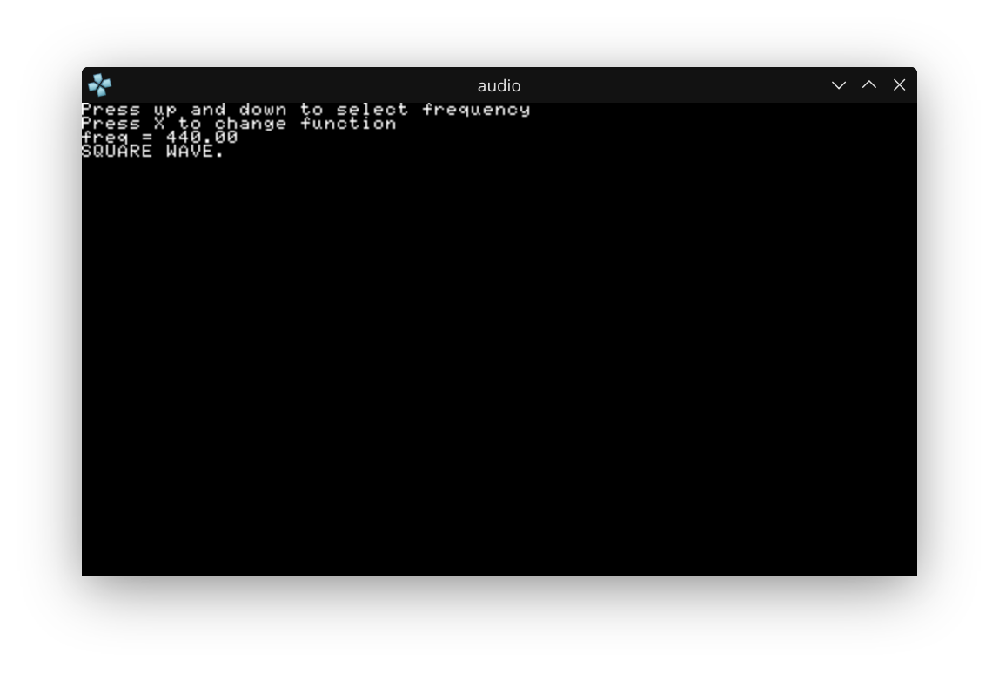

# PSP Homebrew: Simple Audio Synth Example

This project demonstrates how to generate and play simple audio waveforms (sine, square, triangle) on the PSP using the native audio library.

## What This Project Does
- Generates audio in real-time (sine, square, or triangle wave).
- Lets you change the frequency with the analog stick.
- Lets you switch waveform type with the X button.
- Displays the current frequency and waveform on screen.

## How to Build
```bash
mkdir build
cd build
cmake .. -DCMAKE_TOOLCHAIN_FILE=~/pspdev/psp/share/pspdev.cmake
cmake --build .
```
This will generate `EBOOT.PBP` in the `build` directory.

## Screenshot



_Above: The running app showing frequency and waveform type in PPSSPP emulator._

## main.c Source Code
```c
#include <pspkernel.h>
#include <pspdebug.h>
#include <pspaudiolib.h>
#include <pspaudio.h>
#include <pspdisplay.h>
#include <pspctrl.h>

#include <stdlib.h>
#include <string.h>
#include <math.h>
#include <limits.h>

PSP_MODULE_INFO("audio", 0, 1, 1);
PSP_MAIN_THREAD_ATTR(THREAD_ATTR_USER | THREAD_ATTR_VFPU);

#define printf	pspDebugScreenPrintf

/* Exit callback */
int exitCallback(int arg1, int arg2, void *common) {
    sceKernelExitGame();
    return 0;
}

/* Callback thread */
int callbackThread(SceSize args, void *argp) {
    int cbid;

    cbid = sceKernelCreateCallback("Exit Callback", (void*) exitCallback, NULL);
    sceKernelRegisterExitCallback(cbid);
    sceKernelSleepThreadCB();

    return 0;
}

/* Sets up the callback thread and returns its thread id */
int setupCallbacks(void) {
    int thid = 0;

    thid = sceKernelCreateThread("update_thread", callbackThread, 0x11, 0xFA0, 0, 0);
    if (thid >= 0) {
        sceKernelStartThread(thid, 0, 0);
    }
    return thid;
}

/* Main code */

const float PI = 3.1415926535897932f;
const int sampleRate = 44100;
float frequency = 440.0f;
float currentTime = 0;
int function = 0;

typedef struct {
        short l, r;
} sample_t;

float currentFunction(const float time) {
    double x;
    float t = modf((time / (2 * PI)), &x);

    switch(function) {
        case 0: // SINE
            return sinf(time);
        case 1: // SQUARE
            if (t < 0.5f) {
                return -0.2f;
            } else {
                return 0.2f;
            }
        case 2: // TRIANGLE
            if (t < 0.5f) {
                return (t * 2.0f) - 0.5f;
            } else {
                return 0.5f - (t - 0.5f) * 2.0f;
            }
        default:
             return 0.0f;
    }
}

/* This function gets called by pspaudiolib every time the
   audio buffer needs to be filled. The sample format is
   16-bit, stereo. */
void audioCallback(void* buf, unsigned int length, void *userdata) {
    const float sampleLength = 1.0f / sampleRate;
    const float scaleFactor = SHRT_MAX - 1.0f;
    static float freq0 = 440.0f;
    sample_t* ubuf = (sample_t*) buf;
    int i;
    
    if (frequency != freq0) {
            currentTime *= (freq0 / frequency);
    }
    for (i = 0; i < length; i++) {
        short s = (short) (scaleFactor * currentFunction(2.0f * PI * frequency * currentTime));
        ubuf[i].l = s;
        ubuf[i].r = s;
        currentTime += sampleLength;
    }
    if (currentTime * frequency > 1.0f) {
        double d;
        currentTime = modf(currentTime * frequency, &d) / frequency;
    }

    freq0 = frequency;
}

/* Read the analog stick and adjust the frequency */
void controlFrequency(void) {
    static int oldButtons = 0;
    const int zones[6] = {30, 70, 100, 112, 125, 130};
    const float response[6] = {0.0f, 0.1f, 0.5f, 1.0f, 4.0f, 8.0f};
    const float minFreq = 32.0f;
    const float maxFreq = 7040.0f;
    SceCtrlData pad;
    float direction;
    int changedButtons;
    int i, v;

    sceCtrlReadBufferPositive(&pad, 1);

    v = pad.Ly - 128;
    if (v < 0) {
           direction = 1.0f;
        v = -v;
    } else {
        direction = -1.0f;
    }

    for (i = 0; i < 6; i++) {
        if (v < zones[i]) {
            frequency += (response[i] * direction);
            break;
        }
    }

    if (frequency < minFreq) {
        frequency = minFreq;
    } else if (frequency > maxFreq) {
        frequency = maxFreq;
    }

    changedButtons = pad.Buttons & (~oldButtons);
    if (changedButtons & PSP_CTRL_CROSS) {
        function++;
        if (function > 2) {
            function = 0;
        }
    }

    oldButtons = pad.Buttons;
}

int main(void) {
    pspDebugScreenInit();
    setupCallbacks();

    pspAudioInit();
    pspAudioSetChannelCallback(0, audioCallback, NULL);

    sceCtrlSetSamplingCycle(0);
    sceCtrlSetSamplingMode(PSP_CTRL_MODE_ANALOG);

    printf("Press up and down to select frequency\nPress X to change function\n");
    
    while(1) {
        sceDisplayWaitVblankStart();
        pspDebugScreenSetXY(0,2);
        printf("freq = %.2f \n", frequency);

        switch(function) {
            case 0:
                printf("SINE WAVE. \n");
                break;
            case 1:
                  printf("SQUARE WAVE. \n");
                break;
            case 2:
                  printf("TRIANGLE WAVE. \n");
                break;
        }

        controlFrequency();
    }

    return 0;
}
```

---

This README serves as a note for myself and for GitHub, documenting the process and code for generating audio on the PSP using PSPSDK.