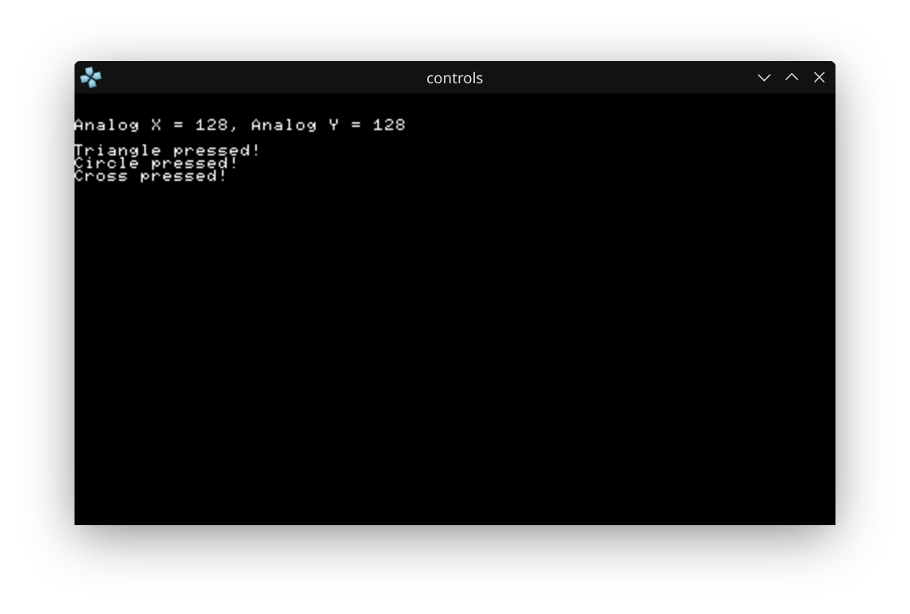

# PSP Homebrew: Reading Controller Input

This project demonstrates how to read and display input from the PSP's controller, including analog stick and button presses.

## What This Project Does
- Continuously reads the analog stick and button states.
- Prints the analog stick X/Y values and which buttons are pressed.
- Exits cleanly when the home button is pressed.

## How to Build
```bash
mkdir build
cd build
cmake .. -DCMAKE_TOOLCHAIN_FILE=~/pspdev/psp/share/pspdev.cmake
cmake --build .
```
This will generate `EBOOT.PBP` in the `build` directory.

## Screenshot



_Above: The running app showing analog and button input in PPSSPP emulator._

## main.c Source Code
```c
#include <pspkernel.h>
#include <pspdebug.h>
#include <pspctrl.h>
#include <stdlib.h>
#include <string.h>

PSP_MODULE_INFO("Controller", 0, 1, 1);

PSP_MAIN_THREAD_ATTR(THREAD_ATTR_USER | THREAD_ATTR_VFPU);

#define printf pspDebugScreenPrintf

int done = 0;

int exit_callback(int arg1, int arg2, void *common)
{
    done = 1;
    return 0;
}

int callback_thread(SceSize args, void *argp)
{
    int cbid = sceKernelCreateCallback("Exit Callback",
        exit_callback, NULL);
    sceKernelRegisterExitCallback(cbid);
    sceKernelSleepThreadCB();
    return 0;
}

int setup_callbacks(void)
{
    int thid = sceKernelCreateThread("update_thread",
        callback_thread, 0x11, 0xFA0, 0, 0);

    if(thid >= 0)
        sceKernelStartThread(thid, 0, 0);
    return thid;
}

int main(void)
{
    SceCtrlData pad;

    pspDebugScreenInit();
    setup_callbacks();

    sceCtrlSetSamplingCycle(0);
    sceCtrlSetSamplingMode(PSP_CTRL_MODE_ANALOG);

    while (!done)
    {
        pspDebugScreenSetXY(0, 2);
        sceCtrlReadBufferPositive(&pad, 1);

        printf("Analog X = %3d, ", pad.Lx);
        printf("Analog Y = %3d \n", pad.Ly);

        if (pad.Buttons != 0)
        {
            if (pad.Buttons & PSP_CTRL_SQUARE)
            {
                printf("Square pressed! \n");
            }
            if (pad.Buttons & PSP_CTRL_TRIANGLE)
            {
                printf("Triangle pressed! \n");
            }
            if (pad.Buttons & PSP_CTRL_CIRCLE)
            {
                printf("Circle pressed! \n");
            }
            if (pad.Buttons & PSP_CTRL_CROSS)
            {
                printf("Cross pressed! \n");
            }

            if (pad.Buttons & PSP_CTRL_UP)
            {
                printf("Up direction pad pressed! \n");
            }
            if (pad.Buttons & PSP_CTRL_DOWN)
            {
                printf("Down direction pad pressed! \n");
            }
            if (pad.Buttons & PSP_CTRL_LEFT)
            {
                printf("Left direction pad pressed! \n");
            }
            if (pad.Buttons & PSP_CTRL_RIGHT)
            {
                printf("Right direction pad pressed! \n");
            }
        }
    }

    sceKernelExitGame();
    return 0;
}
```

---

This README serves as a note for myself and for GitHub, documenting the process and code for reading controller input on the PSP using PSPSDK.