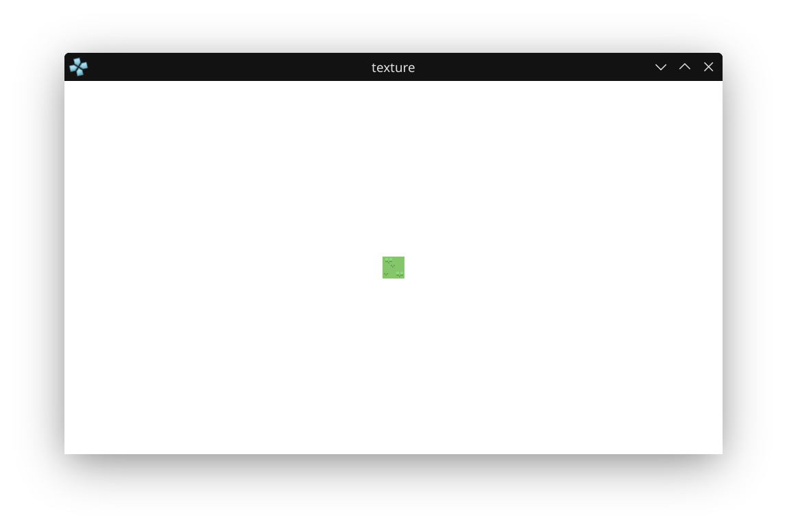

# PSP Homebrew: Drawing a Sprite (Texture)

This project demonstrates how to load and display a PNG sprite (tile) on the PSP using the native libgu graphics library and stb_image for image loading.

## What This Project Does
- Loads a 16x16 PNG image (`grass.png`) as a texture.
- Draws the texture centered on a white background.
- Handles the exit callback for clean quitting.

## How to Build and Run
1. **Build the Project**
   - Open a terminal and navigate to the project directory:
     ```bash
     cd ~/Documents/PSP/psp_projects/drawing_sprite_psp
     ```
   - Create and enter the build directory:
     ```bash
     rm -rf build
     mkdir build
     cd build
     ```
   - Run CMake with the PSPSDK toolchain:
     ```bash
     cmake .. -DCMAKE_TOOLCHAIN_FILE=~/pspdev/psp/share/pspdev.cmake
     ```
   - Build the project:
     ```bash
     cmake --build .
     ```
   - On success, `EBOOT.PBP` will be generated in the `build` directory.

2. **Add the Sprite Image**
   - Copy your `grass.png` (16x16, power-of-2 size) into the `build` directory alongside `EBOOT.PBP`.

3. **Run in PPSSPP Emulator or on PSP**
   - **Important:**
     - Always load the entire `build` folder in your emulator, not just the `EBOOT.PBP` file. If you open only the PBP, the image will not be found and you'll see only a white screen.
   - On a real PSP, copy both `EBOOT.PBP` and `grass.png` to a folder on your memory stick, e.g. `ms0:/PSP/GAME/drawing_sprite_psp/`.

## Screenshot



_Above: The running app showing a grass tile sprite on a white background in PPSSPP emulator._

## main.c Source Code
```c
#include <pspkernel.h>
#include <pspctrl.h>
#include <pspdisplay.h>
#include <pspgu.h>
#include <memory.h>

#define STB_IMAGE_IMPLEMENTATION
#include <stb_image.h>

PSP_MODULE_INFO("texture", 0, 1, 0);
PSP_MAIN_THREAD_ATTR(THREAD_ATTR_USER);

#define BUFFER_WIDTH 512
#define BUFFER_HEIGHT 272
#define SCREEN_WIDTH 480
#define SCREEN_HEIGHT BUFFER_HEIGHT

typedef struct
{
    float u, v;
    uint32_t colour;
    float x, y, z;
} TextureVertex;

typedef struct
{
    int width, height;
    uint32_t * data;
} Texture;

char list[0x20000] __attribute__((aligned(64)));

void * fbp0;
void * fbp1;
int running;

int exit_callback(int arg1, int arg2, void *common) {
    running = 0;
    return 0;
}

int callback_thread(SceSize args, void *argp) {
    int cbid = sceKernelCreateCallback("Exit Callback", exit_callback, NULL);
    sceKernelRegisterExitCallback(cbid);
    sceKernelSleepThreadCB();
    return 0;
}

int setup_callbacks(void) {
    int thid = sceKernelCreateThread("update_thread", callback_thread, 0x11, 0xFA0, 0, 0);
    if(thid >= 0)
        sceKernelStartThread(thid, 0, 0);
    return thid;
}

void initGu(){
    sceGuInit();

    fbp0 = guGetStaticVramBuffer(BUFFER_WIDTH, BUFFER_HEIGHT, GU_PSM_8888);
    fbp1 = guGetStaticVramBuffer(BUFFER_WIDTH, BUFFER_HEIGHT, GU_PSM_8888);

    //Set up buffers
    sceGuStart(GU_DIRECT, list);
    sceGuDrawBuffer(GU_PSM_8888, fbp0, BUFFER_WIDTH);
    sceGuDispBuffer(SCREEN_WIDTH,SCREEN_HEIGHT,fbp1, BUFFER_WIDTH);
    
    // We do not care about the depth buffer in this example
    sceGuDepthBuffer(fbp0, 0); // Set depth buffer to a length of 0
    sceGuDisable(GU_DEPTH_TEST); // Disable depth testing

    //Set up viewport
    sceGuOffset(2048 - (SCREEN_WIDTH / 2), 2048 - (SCREEN_HEIGHT / 2));
    sceGuViewport(2048, 2048, SCREEN_WIDTH, SCREEN_HEIGHT);
    sceGuEnable(GU_SCISSOR_TEST);
    sceGuScissor(0, 0, SCREEN_WIDTH, SCREEN_HEIGHT);

    // Start a new frame and enable the display
    sceGuFinish();
    sceGuDisplay(GU_TRUE);
}

void endGu(){
    sceGuDisplay(GU_FALSE);
    sceGuTerm();
}

void startFrame(){
    sceGuStart(GU_DIRECT, list);
    sceGuClearColor(0xFFFFFFFF); // White background
    sceGuClear(GU_COLOR_BUFFER_BIT);
}

void endFrame(){
    sceGuFinish();
    sceGuSync(0, 0);
    sceDisplayWaitVblankStart();
    sceGuSwapBuffers();
}

Texture * loadTexture(const char * filename) {
    Texture * texture = (Texture *) calloc(1, sizeof(Texture));

    texture->data = (uint32_t *) stbi_load("grass.png", &(texture->width), &(texture->height), NULL, STBI_rgb_alpha);

    // Make sure the texture cache is reloaded
    sceKernelDcacheWritebackInvalidateAll();

    return texture;
}

void drawTexture(Texture * texture, float x, float y, float w, float h) {
    static TextureVertex vertices[2];

    vertices[0].u = 0.0f;
    vertices[0].v = 0.0f;
    vertices[0].colour = 0xFFFFFFFF;
    vertices[0].x = x;
    vertices[0].y = y;
    vertices[0].z = 0.0f;

    vertices[1].u = w;
    vertices[1].v = h;
    vertices[1].colour = 0xFFFFFFFF;
    vertices[1].x = x + w;
    vertices[1].y = y + h;
    vertices[1].z = 0.0f;

    sceGuTexMode(GU_PSM_8888, 0, 0, GU_FALSE);
    sceGuTexFunc(GU_TFX_REPLACE, GU_TCC_RGB);
    sceGuTexImage(0, texture->width, texture->height, texture->width, texture->data);

    sceGuEnable(GU_TEXTURE_2D); 
    sceGuDrawArray(GU_SPRITES, GU_COLOR_8888 | GU_TEXTURE_32BITF | GU_VERTEX_32BITF | GU_TRANSFORM_2D, 2, 0, vertices);
    sceGuDisable(GU_TEXTURE_2D);
}


int main() {
    // Make exiting with the home button possible
    setup_callbacks();

    // Create a texture from a file
    Texture * texture = loadTexture("grass.png");

    // Start rendering
    initGu();

    running = 1;
    while(running){
        startFrame();

        drawTexture(texture, SCREEN_WIDTH / 2 - texture->width / 2, SCREEN_HEIGHT / 2 - texture->height / 2, texture->width, texture->height);

        endFrame();
    }
    // Stop rendering
    endGu();

    // Clean up
    stbi_image_free(texture->data);
    free(texture);

    return 0;
}
```

---

**Disclaimer:**
> When running in an emulator, always load the entire `build` folder (not just `EBOOT.PBP`). If you open only the PBP file, the image will not be found and you'll see only a white screen instead of the sprite.

This README serves as a note for myself and for GitHub, documenting the process and code for drawing a sprite on the PSP using PSPSDK and stb_image.