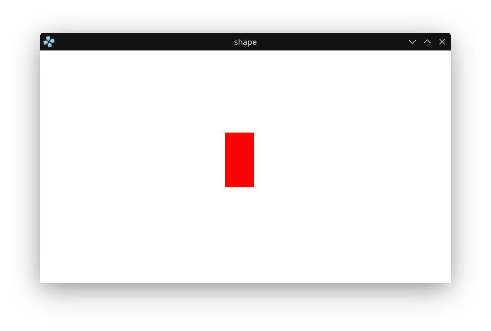

# PSP Homebrew: Drawing a Red Rectangle

This project demonstrates how to draw a simple red rectangle on a white background using the PSP's GU (Graphics Utility) library with PSPSDK.

This is a simple square drawn on the PSP. It uses the native libgu library.

## What This Project Does
- Initializes the PSP graphics system (GU).
- Clears the screen to white each frame.
- Draws a red rectangle in the center of the screen.
- Handles the exit callback so you can quit the app cleanly.

## How to Build and Run
1. **Build the Project**
   - Open a terminal and navigate to the project directory:
     ```bash
     cd ~/Documents/PSP/psp_projects/drawing_square_psp
     ```
   - Create and enter the build directory:
     ```bash
     mkdir -p build
     cd build
     ```
   - Run CMake with the PSPSDK toolchain:
     ```bash
     cmake .. -DCMAKE_TOOLCHAIN_FILE=~/pspdev/psp/share/pspdev.cmake
     ```
   - Build the project:
     ```bash
     cmake --build .
     ```
   - On success, `EBOOT.PBP` and the ELF file will be generated in the `build` directory.

2. **Run in PPSSPP Emulator**
   - Open PPSSPP.
   - Load the `EBOOT.PBP` file from the `build` directory.
   - You should see a white screen with a red rectangle (see screenshot below).

## Screenshot



_Above: The running app showing a red rectangle on a white background in PPSSPP emulator._

## main.c Source Code
```c
#include <pspkernel.h>
#include <pspgu.h>
#include <pspdisplay.h>

PSP_MODULE_INFO("shape", 0, 1, 0);
PSP_MAIN_THREAD_ATTR(THREAD_ATTR_VFPU | THREAD_ATTR_USER);

#define BUFFER_WIDTH 512
#define BUFFER_HEIGHT 272
#define SCREEN_WIDTH 480
#define SCREEN_HEIGHT BUFFER_HEIGHT

char list[0x20000] __attribute__((aligned(64)));
int running;

int exit_callback(int arg1, int arg2, void *common) {
    running = 0;
    return 0;
}

int callback_thread(SceSize args, void *argp) {
    int cbid = sceKernelCreateCallback("Exit Callback", exit_callback, NULL);
    sceKernelRegisterExitCallback(cbid);
    sceKernelSleepThreadCB();
    return 0;
}

int setup_callbacks(void) {
    int thid = sceKernelCreateThread("update_thread", callback_thread, 0x11, 0xFA0, 0, 0);
    if(thid >= 0)
        sceKernelStartThread(thid, 0, 0);
    return thid;
}

void initGu(){
    sceGuInit();

    //Set up buffers
    sceGuStart(GU_DIRECT, list);
    sceGuDrawBuffer(GU_PSM_8888,(void*)0,BUFFER_WIDTH);
    sceGuDispBuffer(SCREEN_WIDTH,SCREEN_HEIGHT,(void*)0x88000,BUFFER_WIDTH);
    sceGuDepthBuffer((void*)0x110000,BUFFER_WIDTH);

    //Set up viewport
    sceGuOffset(2048 - (SCREEN_WIDTH / 2), 2048 - (SCREEN_HEIGHT / 2));
    sceGuViewport(2048, 2048, SCREEN_WIDTH, SCREEN_HEIGHT);
    sceGuEnable(GU_SCISSOR_TEST);
    sceGuScissor(0, 0, SCREEN_WIDTH, SCREEN_HEIGHT);

    //Set some stuff
    sceGuDepthRange(65535, 0); //Use the full buffer for depth testing - buffer is reversed order

    sceGuDepthFunc(GU_GEQUAL); //Depth buffer is reversed, so GEQUAL instead of LEQUAL
    sceGuEnable(GU_DEPTH_TEST); //Enable depth testing

    sceGuFinish();
    sceGuDisplay(GU_TRUE);
}

void endGu(){
    sceGuDisplay(GU_FALSE);
    sceGuTerm();
}

void startFrame(){
    sceGuStart(GU_DIRECT, list);
    sceGuClearColor(0xFFFFFFFF); // White background
    sceGuClear(GU_COLOR_BUFFER_BIT);
}

void endFrame(){
    sceGuFinish();
    sceGuSync(0, 0);
    sceDisplayWaitVblankStart();
    sceGuSwapBuffers();
}

typedef struct {
    unsigned short u, v;
    short x, y, z;
} Vertex;

void drawRect(float x, float y, float w, float h) {

    Vertex* vertices = (Vertex*)sceGuGetMemory(2 * sizeof(Vertex));

    vertices[0].x = x;
    vertices[0].y = y;

    vertices[1].x = x + w;
    vertices[1].y = y + h;

    sceGuColor(0xFF0000FF); // Red, colors are ABGR
    sceGuDrawArray(GU_SPRITES, GU_TEXTURE_16BIT | GU_VERTEX_16BIT | GU_TRANSFORM_2D, 2, 0, vertices);
}


int main() {
    // Make exiting with the home button possible
    setup_callbacks();

    // Setup the library used for rendering
    initGu();

    running = 1;
    while(running){
        startFrame();

        drawRect(216, 96, 34, 64);

        endFrame();
    }

    return 0;
}
```

---

This README serves as a note for myself and for GitHub, documenting the process and code for drawing a rectangle on the PSP using PSPSDK.
