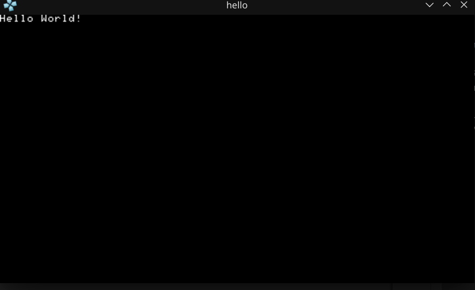

# PSP Homebrew: Hello World Example

This project demonstrates how to build and run a simple "Hello World" homebrew application for the PlayStation Portable (PSP) using PSPSDK and CMake.

## What This Project Does
- Displays "Hello World!" on the PSP screen in a loop.
- Handles the exit callback so you can quit the app cleanly.

## How We Built and Ran It
1. **Project Setup**
   - Cloned or copied the template project structure.
   - Confirmed PSPSDK and PPSSPP emulator were installed and working.

2. **Building the Project**
   - Opened a terminal and navigated to the project directory:
     ```bash
     cd ~/Documents/PSP/psp_projects/hello_world_psp
     ```
   - Entered the build directory (created if missing):
     ```bash
     mkdir -p build
     cd build
     ```
   - Ran CMake with the PSPSDK toolchain:
     ```bash
     cmake .. -DCMAKE_TOOLCHAIN_FILE=~/pspdev/psp/share/pspdev.cmake
     ```
   - Built the project:
     ```bash
     cmake --build .
     ```
   - On success, `EBOOT.PBP` and the ELF file were generated in the `build` directory.

3. **Running in PPSSPP Emulator**
   - Opened PPSSPP.
   - Loaded the `EBOOT.PBP` file from the `build` directory.
   - Saw the "Hello World!" message on the PSP screen (see screenshot below).

## Screenshot



_Above: The running Hello World app in PPSSPP emulator._

## main.c Source Code
```c
#include <pspkernel.h>
#include <pspdebug.h>
#include <pspdisplay.h>

// PSP_MODULE_INFO is required
PSP_MODULE_INFO("Hello World", 0, 1, 0);
PSP_MAIN_THREAD_ATTR(PSP_THREAD_ATTR_USER);

int exit_callback(int arg1, int arg2, void *common) {
    sceKernelExitGame();
    return 0;
}

int callback_thread(SceSize args, void *argp) {
    int cbid = sceKernelCreateCallback("Exit Callback", exit_callback, NULL);
    sceKernelRegisterExitCallback(cbid);
    sceKernelSleepThreadCB();
    return 0;
}

int setup_callbacks(void) {
    int thid = sceKernelCreateThread("update_thread", callback_thread, 0x11, 0xFA0, 0, 0);
    if(thid >= 0)
        sceKernelStartThread(thid, 0, 0);
    return thid;
}

int main(void)  {
    // Use above functions to make exiting possible
    setup_callbacks();

    // Print Hello World! on a debug screen on a loop
    pspDebugScreenInit();
    while(1) {
        pspDebugScreenSetXY(0, 0);
        pspDebugScreenPrintf("Hello World!");
        sceDisplayWaitVblankStart();
    }

    return 0;
}
```

---

This README serves as a note for myself and for GitHub, documenting the process and code for building a basic PSP homebrew app.
