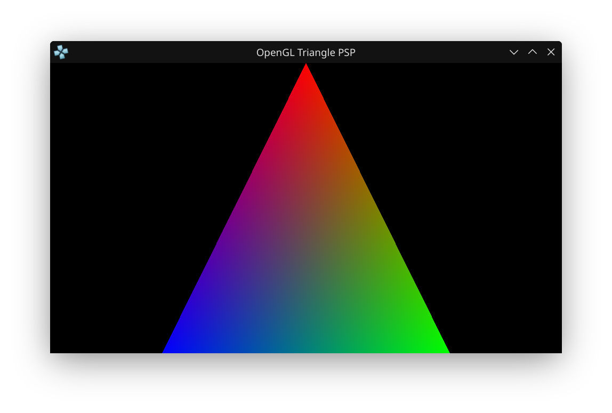

# PSP Homebrew: OpenGL Triangle PSP

This project demonstrates how to render a simple colored triangle on the PSP using the GU (Graphics Utility) and GUM (matrix) libraries, mimicking a basic OpenGL pipeline.

## What This Project Does
- Initializes the PSP graphics system (GU/GUM).
- Renders a single triangle with three different vertex colors.
- Handles the exit callback so you can quit the app cleanly.

## How to Build
```bash
mkdir build
cd build
cmake .. -DCMAKE_TOOLCHAIN_FILE=~/pspdev/psp/share/pspdev.cmake
cmake --build .
```
This will generate `EBOOT.PBP` in the `build` directory.

## Screenshot



_Above: The running app showing a colored triangle in PPSSPP emulator._

--- Code ---
#include <pspkernel.h>
#include <pspdebug.h>
#include <pspdisplay.h>
#include <pspgu.h>
#include <pspgum.h>

static int exitRequest  = 1;

int isRunning()
{
	return exitRequest;
}

int exitCallback(int arg1, int arg2, void *common) 
{ 
	exitRequest = 0; 
	return 0; 
} 

int callbackThread(SceSize args, void *argp) 
{ 
	int callbackID; 

	callbackID = sceKernelCreateCallback("Exit Callback", exitCallback, NULL); 
	sceKernelRegisterExitCallback(callbackID); 

	sceKernelSleepThreadCB(); 

	return 0; 
} 

int setupExitCallback() 
{ 
	int threadID = 0; 

	threadID = sceKernelCreateThread("Callback Update Thread", callbackThread, 0x11, 0xFA0, THREAD_ATTR_USER, 0); 
	 
	if(threadID >= 0) 
	{ 
		sceKernelStartThread(threadID, 0, 0); 
	} 

	return threadID; 
}

PSP_MODULE_INFO("OpenGL Triangle PSP", PSP_MODULE_USER, 1, 0);

#define SCREEN_WIDTH 480
#define SCREEN_HEIGHT 272
#define BUFFER_WIDTH 512

unsigned int list[64*1024];

struct Vertex {
    unsigned int color;
    float x,y,z;
} vertices[] = {
    { 0xFF0000ff,  0,  1, -1 },
    { 0xFF00ff00,  1, -1, -1 },
    { 0xFFff0000, -1, -1, -1 },
};

void initialize() {
    void* videoRam   = 0;
    void* displayRam = videoRam;
    void* drawRam    = displayRam + BUFFER_WIDTH * SCREEN_HEIGHT * 4;
    
    sceGuInit();
        
    sceGuStart(GU_DIRECT, list);
    
    sceGuDispBuffer(SCREEN_WIDTH, SCREEN_HEIGHT, displayRam, BUFFER_WIDTH);
    sceGuDrawBuffer(GU_PSM_8888, drawRam, BUFFER_WIDTH);
    
    sceGuOffset(0,0);
    sceGuViewport(SCREEN_WIDTH/2, SCREEN_HEIGHT/2, SCREEN_WIDTH, SCREEN_HEIGHT);
    
    sceGuScissor(0,0, SCREEN_WIDTH, SCREEN_HEIGHT);
    sceGuEnable(GU_SCISSOR_TEST);
    
    sceGuFrontFace(GU_CW);
    sceGuShadeModel(GU_SMOOTH);
    sceGuDisplay(GU_TRUE);
    
    sceGuFinish();
    sceGuSync(0,0);
    
    sceDisplayWaitVblank();
    sceGuSwapBuffers();
}

void display() {

    sceGuStart(GU_DIRECT, list);
    
    sceGuClearDepth(0);
    sceGuClear(GU_COLOR_BUFFER_BIT|GU_DEPTH_BUFFER_BIT);

    sceGumMatrixMode(GU_VIEW);
    sceGumLoadIdentity();
    
    sceGumMatrixMode(GU_PROJECTION);
    sceGumLoadIdentity();
    sceGumPerspective(90, 16.0/9.0, 1, 100); 

    sceGumMatrixMode(GU_MODEL);
    sceGumLoadIdentity();
    
    sceGumDrawArray(GU_TRIANGLES, GU_COLOR_8888|GU_VERTEX_32BITF|GU_TRANSFORM_3D, 3, 0, vertices);
    
    sceGuFinish();
    sceGuSync(0,0);
    
    sceDisplayWaitVblank();
    sceGuSwapBuffers();
}

int main(int argc, char** argv)
{
    setupExitCallback();

    initialize();

    while(isRunning()) {
        display();
    }

    sceKernelExitGame();
    return 0;
}

---

This README documents the process and code for rendering a colored triangle on the PSP using PSPSDK.