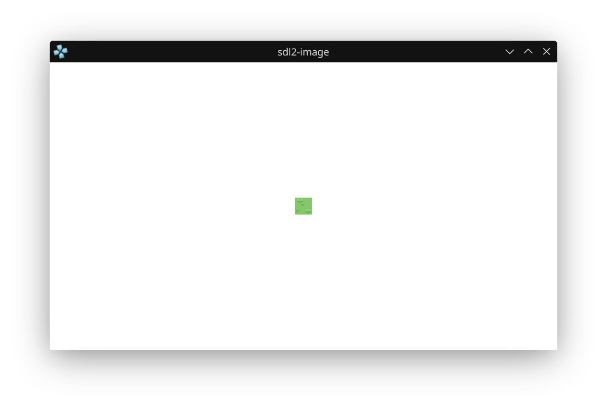

# PSP Homebrew: Drawing an Image with SDL2_image



SDL2_image is a library which adds support for multiple image formats to SDL2. This example results in the same image as the sprite example using libgu above. Here, the limitation of the image width being a power of 2 does not apply.

Despite this example adding an option to close by pressing the start button, the code is much shorter. It can even be built for Linux without any further modifications.

## What This Project Does
- Loads a PNG image (`grass.png`) using SDL2_image.
- Draws the image centered on a white background.
- Lets you close the program by pressing the Start button or closing the window.
- The same code builds and runs on both PSP and Linux (if SDL2 and SDL2_image are installed).

## How to Build
### For Linux
```bash
sudo dnf install SDL2-devel SDL2_image-devel
mkdir build
cd build
cmake ..
make
```
This will generate a native Linux binary you can run on your desktop.

### For PSP
If you have the PSP toolchain and SDL2/SDL2_image for PSP:
```bash
mkdir build
cd build
psp-cmake ..
make
```
This should generate `EBOOT.PBP` in the `build` directory (if your PSP CMake modules are set up).

## main.c Source Code
```c
#include <SDL.h>
#include <SDL_image.h>

int main(int argc, char *argv[])
{
    SDL_Init(SDL_INIT_VIDEO | SDL_INIT_GAMECONTROLLER);

    // Enable png support for SDL2_image
    IMG_Init(IMG_INIT_PNG);

    SDL_Window * window = SDL_CreateWindow(
        "window",
        SDL_WINDOWPOS_UNDEFINED,
        SDL_WINDOWPOS_UNDEFINED,
        480,
        272,
        0
    );

    SDL_Renderer * renderer = SDL_CreateRenderer(window, -1, SDL_RENDERER_ACCELERATED);

    // Load the texture
    SDL_Surface * pixels = IMG_Load("grass.png");
    SDL_Texture * sprite = SDL_CreateTextureFromSurface(renderer, pixels);
    SDL_FreeSurface(pixels);

    // Store the dimensions of the texture
    SDL_Rect sprite_rect;
    SDL_QueryTexture(sprite, NULL, NULL, &sprite_rect.w, &sprite_rect.h);

    // Set the position to draw to in the middle of the screen
    sprite_rect.x = 480/2 - sprite_rect.w/2;
    sprite_rect.y = 272/2 - sprite_rect.h/2;

    int running = 1;
    SDL_Event event;
    while (running) { 
        // Process input
        if (SDL_PollEvent(&event)) {
            switch (event.type) {
                case SDL_QUIT:
                    // End the loop if the programs is being closed
                    running = 0;
                    break;
                case SDL_CONTROLLERDEVICEADDED:
                    // Connect a controller when it is connected
                    SDL_GameControllerOpen(event.cdevice.which);
                    break;
                case SDL_CONTROLLERBUTTONDOWN:
                    if(event.cbutton.button == SDL_CONTROLLER_BUTTON_START) {
                        // Close the program if start is pressed
                        running = 0;
                    }
                    break;
            }
        }

        // Clear the screen
        SDL_RenderClear(renderer);

        // Draw the 'grass' sprite
        SDL_RenderCopy(renderer, sprite, NULL, &sprite_rect);

        // Draw everything on a white background
        SDL_SetRenderDrawColor(renderer, 255, 255, 255, 255);
        SDL_RenderPresent(renderer);
    }
    SDL_DestroyRenderer(renderer);
    SDL_DestroyWindow(window);
    SDL_Quit();

    return 0;
}
```

---

This README serves as a note for myself and for GitHub, documenting the process and code for drawing an image on the PSP and Linux using SDL2_image.