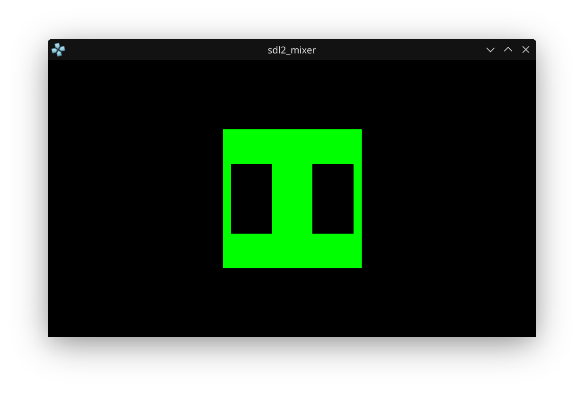

# SDL2_mixer PSP Example

This project demonstrates using SDL2 and SDL2_mixer for audio playback and simple graphics, targeting both Linux and PSP (via emulator).




## Controls (Keyboard → PSP Mapping)

| PSP Button | Emulator Key (Default) | Action           |
|------------|-----------------------|------------------|
| Cross (X)  | Z                     | Pause music      |
| Circle (O) | X                     | Resume music     |
| Square     | A                     | (unused)         |
| Triangle   | S                     | (unused)         |
| Start      | Space                 | Exit program     |
| Select     | Backspace             | (unused)         |
| D-Pad      | Arrow keys            | (unused)         |
| L / R      | Q / E                 | (unused)         |

**How it works:**
- Press **Cross (X)** (Z key) to pause the music. A pause symbol appears on the green square.
- Press **Circle (O)** (X key) to resume playback.
- Press **Start** (Space key) to exit the program.

## Features
- Plays an OGG music file in a loop using SDL2_mixer
- Draws a green square in the center of the screen
- Shows a pause symbol when music is paused
- Simple input handling for pause/resume/exit

## Build & Run Instructions
1. **Place your OGG file**
	- Copy your `test.ogg` music file into the `build` directory before running.
2. **Build**
	- Run `make` in the `build` directory.
3. **Run**
	- Execute the binary from the `build` directory: `./sdl2_mixer`

## Important Note
> **You must set the audio file path in code for Linux/Windows/emulator testing:**
> ```c
> // audio file path * Biggest Headache ever
> #define MUSIC_PATH "test.ogg" // For Linux/Windows/emulator testing
> ```
> This ensures the program finds your music file. For PSP hardware, you may need to adjust the path.

## Troubleshooting
- If you hear no audio, check your system volume and that `test.ogg` is present and playable.
- If the window appears but nothing happens, check the terminal for SDL2 or SDL2_mixer errors.
- If running on PSP hardware, SDL2_mixer support may be limited.

## License
This project uses SDL2 and SDL2_mixer, which are under the zlib license. See LICENSE.txt for details.
