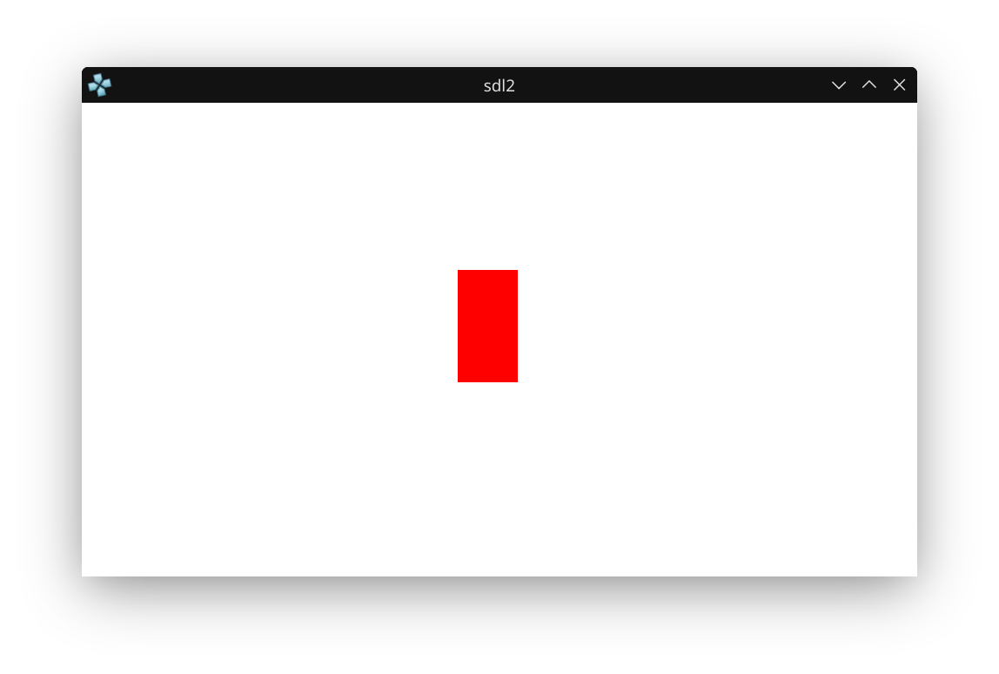

# PSP Homebrew: Drawing a Square with SDL2

This project demonstrates how to use SDL2 to draw a red rectangle on a white background, with code that runs on both PSP and Linux.

## What This Project Does
- Uses SDL2 for window, rendering, and input.
- Draws a red rectangle on a white background.
- Lets you close the program by pressing the Start button or closing the window.
- The same code builds and runs on both PSP and Linux (if SDL2 is installed).

## How to Build
### For PSP
```bash
mkdir build
cd build
cmake .. -DCMAKE_TOOLCHAIN_FILE=~/pspdev/psp/share/pspdev.cmake
cmake --build .
```
This will generate `EBOOT.PBP` in the `build` directory. Put it in a directory in `ms0:/PSP/GAME/` and the PSP can run it.

### For Linux
```bash
sudo apt-get install libsdl2-dev
mkdir build
cd build
cmake ..
make
```
This will generate a native Linux binary you can run on your desktop.

## Screenshot



_Above: The running app showing a red rectangle on a white background in PPSSPP emulator._

## main.c Source Code
```c
#include <SDL.h>

int main(int argc, char *argv[])
{
    SDL_Init(SDL_INIT_VIDEO | SDL_INIT_GAMECONTROLLER);

    SDL_Window * window = SDL_CreateWindow(
        "window",
        SDL_WINDOWPOS_UNDEFINED,
        SDL_WINDOWPOS_UNDEFINED,
        480,
        272,
        0
    );

    SDL_Renderer * renderer = SDL_CreateRenderer(window, -1, SDL_RENDERER_ACCELERATED);

    SDL_Rect square = {216, 96, 34, 64}; 

    int running = 1;
    SDL_Event event;
    while (running) { 
        // Process input
        if (SDL_PollEvent(&event)) {
            switch (event.type) {
                case SDL_QUIT:
                    // End the loop if the programs is being closed
                    running = 0;
                    break;
                case SDL_CONTROLLERDEVICEADDED:
                    // Connect a controller when it is connected
                    SDL_GameControllerOpen(event.cdevice.which);
                    break;
                case SDL_CONTROLLERBUTTONDOWN:
                    if(event.cbutton.button == SDL_CONTROLLER_BUTTON_START) {
                        // Close the program if start is pressed
                        running = 0;
                    }
                    break;
            }
        }

        // Clear the screen
        SDL_RenderClear(renderer);

        // Draw a red square
        SDL_SetRenderDrawColor(renderer, 255, 0, 0, 255);
        SDL_RenderFillRect(renderer, &square);

        // Draw everything on a white background
        SDL_SetRenderDrawColor(renderer, 255, 255, 255, 255);
        SDL_RenderPresent(renderer);
    }
    SDL_DestroyRenderer(renderer);
    SDL_DestroyWindow(window);
    SDL_Quit();

    return 0;
}
```

---

This README serves as a note for myself and for GitHub, documenting the process and code for drawing a rectangle on the PSP and Linux using SDL2.