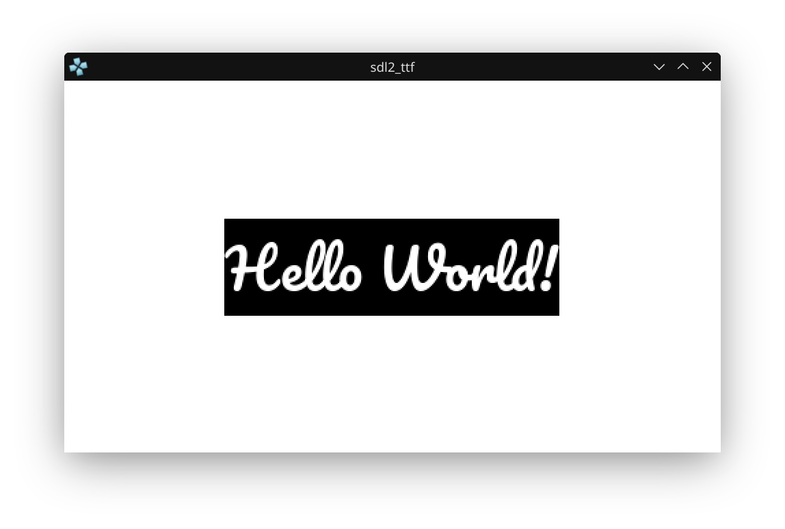

# PSP Homebrew: SDL2_ttf Font Rendering

This project demonstrates using SDL2_ttf to render TrueType fonts on the PSP and Linux using SDL2.



_Above: The running app showing text rendered with Pacifico.ttf on a white background in PPSSPP emulator._

## What This Project Does
- Uses SDL2 and SDL2_ttf for window, rendering, and font text.
- Renders a string using a TTF font (Pacifico.ttf).
- The same code builds and runs on both PSP and Linux (if SDL2/SDL2_ttf are installed).

## How to Build
### For PSP
```bash
mkdir build
cd build
psp-cmake ..
make
```
This will generate `EBOOT.PBP` in the `build` directory. Put it in a directory in `ms0:/PSP/GAME/` and the PSP can run it.

### For Linux
```bash
sudo apt-get install libsdl2-dev libsdl2-ttf-dev
mkdir build
cd build
cmake ..
make
```
This will generate a native Linux binary you can run on your desktop.

## Font Placement
> **Important:** You must place `Pacifico.ttf` in the same directory Build folder as your `EBOOT.PBP` (or the executable) for the program to find and load the font.


## Disclaimer / Troubleshooting
> **If you get only a white screen with text or EBOOT.PBP is not created:**
> - The most time-consuming issue was not with the code or CMakeLists.txt, but with missing PSP CMake modules/macros (like `create_pbp_file`).
> - The solution was to use the `psp-cmake` script found in the `~/pspdev/bin/` directory, which sets up the correct environment and modules for PSP builds. This script is essential if the CMake modules are not in the standard `share` folder.
> - Make sure you use `psp-cmake` or have the correct PSP CMake modules in your toolchain.
> - The code and CMakeLists.txt from the official PSPDev tutorial are correct.

## License
This project uses SDL2, SDL2_ttf, and FreeType, which are under the zlib license. See LICENSE.txt for details.