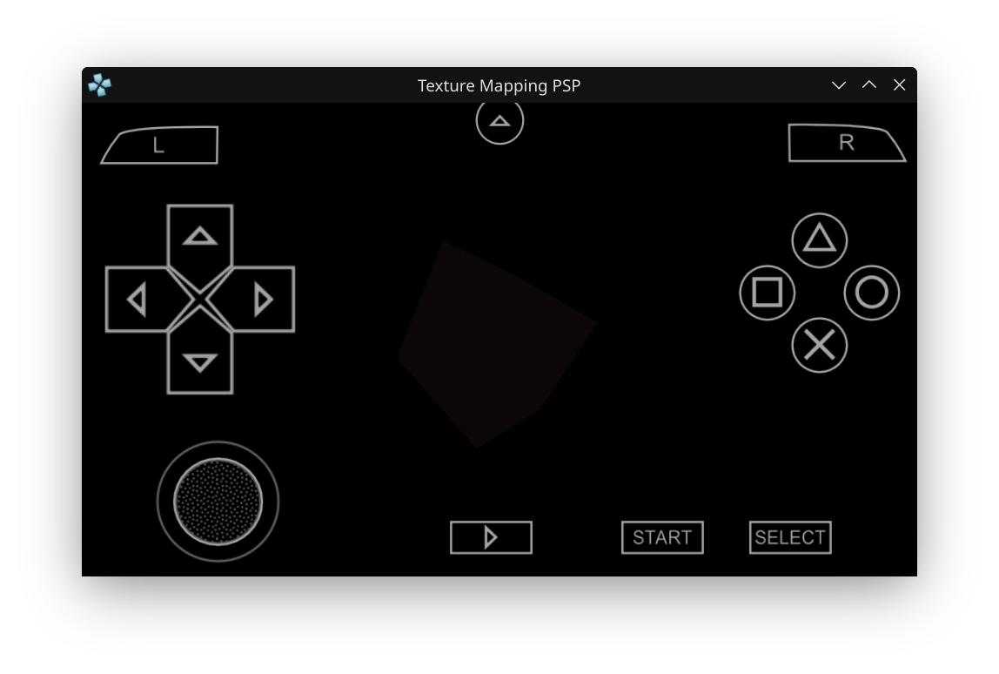

# PSP Homebrew: Texture Mapping PSP Demo

This project demonstrates how to render a 3D colored cube on the PSP using the GU (Graphics Utility) and GUM (matrix) libraries. You can rotate the cube using the analog stick.
---
Project from EightSprites Youtube Series
---

## What This Project Does
- Initializes the PSP graphics system (GU/GUM).
- Renders a 3D cube with different colored faces.
- Lets you rotate the cube in real time using the analog stick.
- Handles the exit callback so you can quit the app cleanly.

## How to Build
```bash
mkdir build
cd build
cmake .. -DCMAKE_TOOLCHAIN_FILE=~/pspdev/psp/share/pspdev.cmake
cmake --build .
```
This will generate `EBOOT.PBP` in the `build` directory.

## Screenshots



_Above: The running app showing a colored 3D cube in PPSSPP emulator. Use the analog stick to rotate the cube. The second screenshot is the latest capture._

> **Disclaimer:**
> The cube in this demo appears darker than it should, and when you rotate the cube, you will notice an outline effect. This is visible in the screenshot above. The result looks different from the one shown in the EightSprites YouTube video—the shadow effect seems to carry over in this version. The screenshot provided is from my own build and may not match the reference video exactly.

## psp_texture.c Source Code
---
#include <pspkernel.h>
#include <pspdebug.h>
#include <pspdisplay.h>
#include <pspctrl.h>
#include <pspgu.h>
#include <pspgum.h>

static int exitRequest  = 1;

int isRunning()
{
	return exitRequest;
}

int exitCallback(int arg1, int arg2, void *common) 
{ 
	exitRequest = 0; 
	return 0; 
} 

int callbackThread(SceSize args, void *argp) 
{ 
	int callbackID; 

	callbackID = sceKernelCreateCallback("Exit Callback", exitCallback, NULL); 
	sceKernelRegisterExitCallback(callbackID); 

	sceKernelSleepThreadCB(); 

	return 0; 
} 

int setupExitCallback() 
{ 
	int threadID = 0; 

	threadID = sceKernelCreateThread("Callback Update Thread", callbackThread, 0x11, 0xFA0, THREAD_ATTR_USER, 0); 
	 
	if(threadID >= 0) 
	{ 
		sceKernelStartThread(threadID, 0, 0); 
	} 

	return threadID; 
}

PSP_MODULE_INFO("Texture Mapping PSP", PSP_MODULE_USER, 1, 0);

#define SCREEN_WIDTH 480
#define SCREEN_HEIGHT 272
#define BUFFER_WIDTH 512

unsigned int list[64*1024];

struct Vertex {
    float u,v;
    unsigned int color;
    float x,y,z;
} vertices[] = {
//    { 0,0, 0xFF000000, -0.5, -0.5, -0.5, },
//    { 1,0, 0xFF0000ff,  0.5, -0.5, -0.5, },
//    { 1,1, 0xFF00ff00,  0.5,  0.5, -0.5, },
//    { 0,1, 0xFF00ffff, -0.5,  0.5, -0.5, },
//    { 1,1, 0xFFff0000, -0.5, -0.5,  0.5, },
//    { 0,1, 0xFFff00ff,  0.5, -0.5,  0.5, },
//    { 0,0, 0xFFffff00,  0.5,  0.5,  0.5, },
//    { 1,0, 0xFFffffff, -0.5,  0.5,  0.5, },
    { 0,0, 0xFFffffff, -0.5, -0.5, -0.5, },
    { 1,0, 0xFFffffff,  0.5, -0.5, -0.5, },
    { 1,1, 0xFFffffff,  0.5,  0.5, -0.5, },
    { 0,1, 0xFFffffff, -0.5,  0.5, -0.5, },
    { 1,1, 0xFFffffff, -0.5, -0.5,  0.5, },
    { 0,1, 0xFFffffff,  0.5, -0.5,  0.5, },
    { 0,0, 0xFFffffff,  0.5,  0.5,  0.5, },
    { 1,0, 0xFFffffff, -0.5,  0.5,  0.5, },
};

unsigned short indices[] = {
    0, 1, 2,   2, 3, 0,
    4, 5, 6,   6, 7, 4,
    0, 4, 7,   7, 3, 0,
    5, 2, 1,   5, 6, 2,
    0, 1, 4,   1, 5, 4,
    2, 3, 7,   2, 6, 7,
};

float rotationX = 0;
float rotationY = 0;

#define __ES_INCLUDE_IMAGE
#include "image_256x256.c"

unsigned int texture[16*16];

void fillInTexture() {
    int x, y;
    
    for(y=0; y<16; y++) {
        for(x=0; x<16; x++) {
            texture[y*16+x] = (x*y) % 2 ? 0xFF00ff00 : 0xFF0000ff;
        }
    }
}

void* textureRam;

void initialize() {
    void* videoRam   = 0;
    void* displayRam = videoRam;
    void* drawRam    = displayRam + BUFFER_WIDTH * SCREEN_HEIGHT * 4;
    void* depthRam   = drawRam + BUFFER_WIDTH * SCREEN_HEIGHT * 4;
    textureRam       = depthRam + BUFFER_WIDTH * SCREEN_HEIGHT * 2;
    
    sceGuInit();
        
    sceGuStart(GU_DIRECT, list);
    
    sceGuDispBuffer(SCREEN_WIDTH, SCREEN_HEIGHT, displayRam, BUFFER_WIDTH);
    sceGuDrawBuffer(GU_PSM_8888, drawRam, BUFFER_WIDTH);
    sceGuDepthBuffer(depthRam, BUFFER_WIDTH);
    
    sceGuOffset(0,0);
    sceGuViewport(SCREEN_WIDTH/2, SCREEN_HEIGHT/2, SCREEN_WIDTH, SCREEN_HEIGHT);
    
    sceGuScissor(0,0, SCREEN_WIDTH, SCREEN_HEIGHT);
    sceGuEnable(GU_SCISSOR_TEST);
    
    sceGuFrontFace(GU_CW);
    sceGuShadeModel(GU_SMOOTH);
    sceGuDisplay(GU_TRUE);
    
    sceGuEnable(GU_DEPTH_TEST);
    sceGuDepthFunc(GU_GEQUAL);
    sceGuDepthRange(65535, 0);
    sceGuEnable(GU_CLIP_PLANES);
    
    sceGuCopyImage(GU_PSM_8888, 0,0, 256,256, 256, imageData.pixel_data, 0,0, 256, (long)textureRam + sceGeEdramGetAddr());
//    sceGuCopyImage(GU_PSM_8888, 0,0, 16,16, 16, texture, 0,0, 16, (long)textureRam + sceGeEdramGetAddr());
    sceGuTexFlush();
    
    sceGuEnable(GU_TEXTURE_2D);
    
    sceGuFinish();
    sceGuSync(0,0);
    
    sceDisplayWaitVblank();
    sceGuSwapBuffers();
}

void display() {

    sceGuStart(GU_DIRECT, list);
    
    sceGuClearDepth(0);
    sceGuClear(GU_COLOR_BUFFER_BIT|GU_DEPTH_BUFFER_BIT);

    sceGumMatrixMode(GU_VIEW);
    sceGumLoadIdentity();
    
    sceGumMatrixMode(GU_PROJECTION);
    sceGumLoadIdentity();
    sceGumPerspective(90, 16.0/9.0, 1, 100);
    sceGumTranslate(&(struct ScePspFVector3) {0.0, 0.0, -2.0});

    sceGumMatrixMode(GU_MODEL);
    sceGumLoadIdentity();    
    sceGumRotateZYX(&(struct ScePspFVector3) {0.0, 3.14, 0.0});
    sceGumRotateZYX(&(struct ScePspFVector3) {rotationX, rotationY, 0.0});
    
    
    sceGuTexMode(GU_PSM_8888, 0,0,0);
    sceGuTexImage(0, 256,256, 256, (long)textureRam + sceGeEdramGetAddr());
//    sceGuTexImage(0, 16,16, 16, (long)textureRam + sceGeEdramGetAddr());
    sceGumDrawArray(GU_TRIANGLES, GU_TEXTURE_32BITF|GU_COLOR_8888|GU_VERTEX_32BITF|GU_INDEX_16BIT|GU_TRANSFORM_3D, 12*3, indices, vertices);
    
    sceGuFinish();
    sceGuSync(0,0);
    
    sceDisplayWaitVblank();
    sceGuSwapBuffers();
}

void pspSetup() {
    sceCtrlSetSamplingCycle(0);
    sceCtrlSetSamplingMode(PSP_CTRL_MODE_ANALOG);
}

void keyboard() {
    SceCtrlData controller;
    
    sceCtrlPeekBufferPositive(&controller, 1);
            
    rotationX = (controller.Lx + 128.0) / 256.0;
    rotationY = (controller.Ly + 128.0) / 256.0;
}

int main(int argc, char** argv)
{
    setupExitCallback();

    fillInTexture();

    pspSetup();
    initialize();

    while(isRunning()) {
        keyboard();
        display();
    }

    sceKernelExitGame();
    return 0;
}

---

This README documents the process and code for rendering a 3D cube on the PSP using PSPSDK.